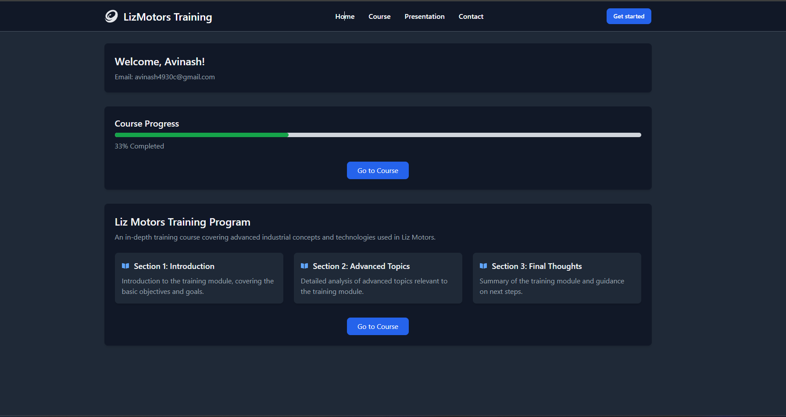
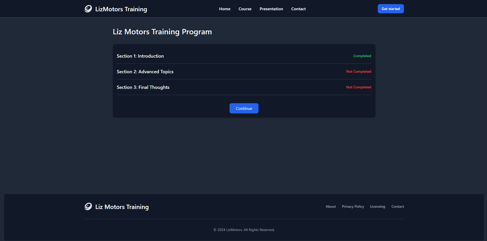
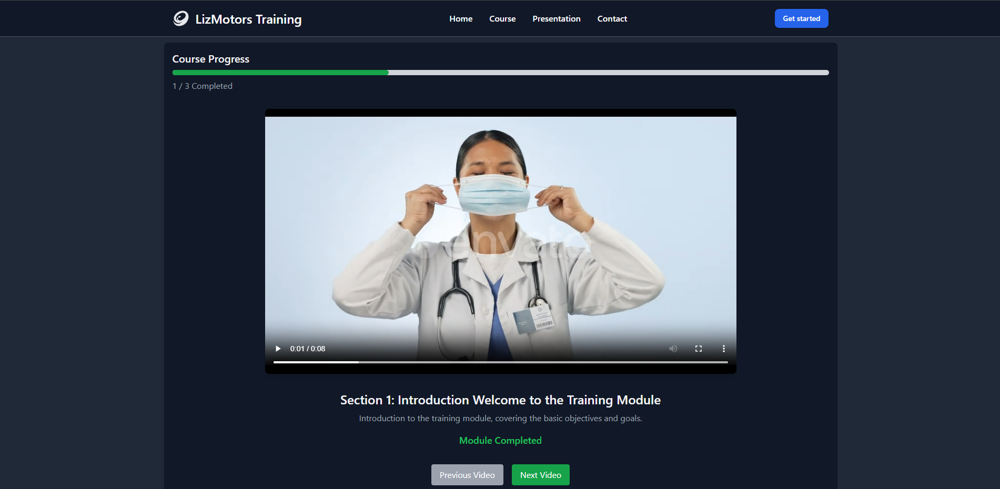
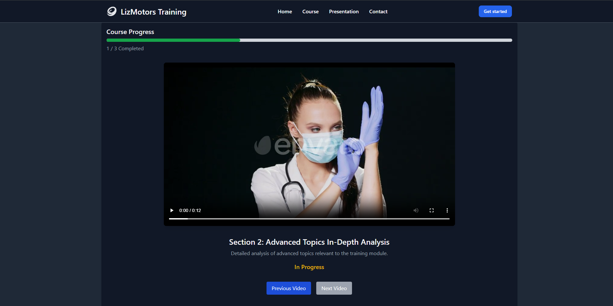
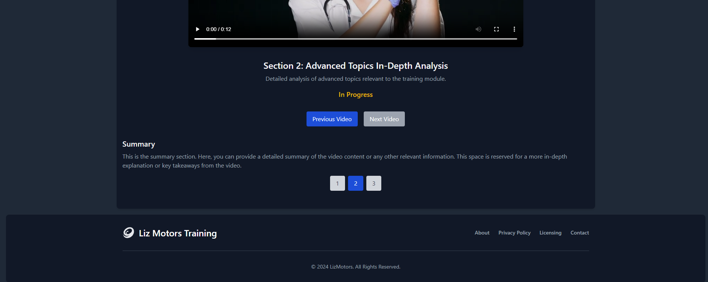

# Full Stack Training Module

## 1. Solution Overview

The Full Stack Training Module application is designed to provide a structured and interactive training experience for employees. This prototype ensures that videos are watched in a specified order, with features to resume playback from the last stop, track progress, and navigate back without the ability to fast-forward. The application meets all the requested features and they are functioning as expected.

Currently, the application supports a single user for demonstration purposes. However, the schemas and architecture are designed with future scalability in mind, allowing for the addition of multiple users and other enhancements in a future version.

### Frameworks and Libraries Used

- **Frontend**: React, Tailwind CSS, HTML5 Video Player
- **Backend**: Node.js with Express.js
- **Database**: MongoDB
- **Video Storage**: Cloudinary
- **TypeScript**: Used for type safety and improved code quality in the React project

## 2. Detailed Description

### Frontend Implementation

- **React for UI**: React's component-based architecture was used to build a dynamic and interactive user interface. TypeScript enhances the development experience with strong typing, making the code more robust and maintainable.

- **Tailwind CSS for Styling**: Tailwind CSS was employed to ensure a responsive and aesthetically pleasing design. The utility-first approach of Tailwind allows for rapid UI development and customization.

- **HTML5 Video Player**: Integrated the native HTML5 video player to handle video playback. This avoids additional dependencies and leverages built-in video controls.

- **TypeScript**: TypeScript was used throughout the project to ensure type safety and better development experience. It helps catch errors early and improves code readability and maintainability.

- **Pagination and Navigation**: Implemented pagination to allow users to navigate through different video sections easily. This functionality ensures smooth transitions between video modules.

- **Progress Tracking**: Added features to track and display user progress, including completion percentage and module status, enhancing user engagement and tracking.

### Backend Implementation

- **Node.js and Express.js**: Used Node.js with Express.js to handle server-side logic and API requests. This setup facilitates efficient communication between the frontend and backend.

- **MongoDB for Database**: Designed a MongoDB schema to manage video metadata, user progress, and additional data. MongoDB's schema flexibility accommodates evolving application requirements.

- **Cloudinary for Video Storage**: Leveraged Cloudinary to store and manage video files. Cloudinary's scalable and secure storage solutions ensure efficient video delivery and access.

- **API Endpoints**: Created RESTful API endpoints to manage user data, video metadata, and progress updates. These endpoints are crucial for synchronizing user interactions with the video content.

# Project Screenshots

## Screenshot 1


## Screenshot 2


## Screenshot 3


## Screenshot 4


## Screenshot 5


## Code Snippets

Video Component

The video component is responsible for rendering the video player with playback controls and tracking the watched progress. Here’s a snippet of the implementation:

```tsx
<div className="w-full mb-8 flex justify-center">
  <video
    autoPlay={true}
    ref={videoRef}
    src={`${currentCourseDetails.videoUrl}#t=${user?.courseProgress[currentSectionIndex].watchedUntil}`}
    controls
    controlsList="nofastforward noplaybackrate"
    className="max-w-4xl w-full rounded-lg shadow-lg bg-black"
    onEnded={handleVideoEnd}
  >
    Your browser does not support the video tag.
  </video>
</div>
```

Code Example: useEffect for Watched Duration

Effect Hook: Updates the watched duration in the backend when the watchedDuration state changes.

```tsx
useEffect(() => {
  const updateWatchedDuration = async () => {
    if (user && currentCourseDetails.sectionID && watchedDuration > 0) {
      try {
        const response = await fetch(`${import.meta.env.VITE_API_URL}/users/${user.name}/watched-duration`, {
          method: 'POST',
          headers: {
            'Content-Type': 'application/json',
          },
          body: JSON.stringify({
            courseId: currentCourseDetails.sectionID,
            watchedDuration: watchedDuration,
          })
        });
        if (!response.ok) {
          console.error("Failed to update watched duration.");
        }
      } catch (error) {
        console.error("Error updating watched duration:", error);
      }
    }
  };

  updateWatchedDuration();
}, [watchedDuration]);
```

Video End Handler: Marks the current section as completed and updates the user's progress.

```tsx
const handleVideoEnd = async () => {
  if (user && currentCourseDetails.sectionID && !user.courseProgress[currentSectionIndex].completed) {
    try {
      const response = await fetch(`${import.meta.env.VITE_API_URL}/users/${user.name}/progress`, {
        method: 'POST',
        headers: {
          'Content-Type': 'application/json',
        },
        body: JSON.stringify({
          courseId: currentCourseDetails.sectionID,
          progress: {
            completed: true,
            lastPlayedTime: videoRef.current?.currentTime ?? 0,
          }
        })
      });
      if (response.ok) {
        fetchUser();
      } else {
        console.error("Failed to update user progress.");
      }
    } catch (error) {
      console.error("Error updating user progress:", error);
    }
  }
};
```


**Code Example: Pagination Component**

```tsx
import React from 'react';

interface PaginationProps {
  totalPages: number;
  currentPage: number;
  onPageChange: (page: number) => void;
}

const Pagination: React.FC<PaginationProps> = ({ totalPages, currentPage, onPageChange }) => (
  <div className="flex space-x-2 justify-center">
    {Array.from({ length: totalPages }, (_, index) => (
      <button
        key={index}
        onClick={() => onPageChange(index)}
        className={`${
          currentPage === index ? "bg-blue-700 text-white" : "bg-gray-300 text-gray-700"
        } py-2 px-4 rounded`}
        style={{ transition: 'background-color 0.3s, transform 0.3s' }}
      >
        {index + 1}
      </button>
    ))}
  </div>
);

export default Pagination;
      </main>
    </div>
  );
};
```

**Code Example: Progress Bar**

Displays the user’s progress with a visual bar showing completion percentage.

```tsx
const ProgressBar: React.FC<{ progressPercentage: number; completedCourses: number; totalCourses: number; }> = ({ progressPercentage, completedCourses, totalCourses }) => (
  <div className="w-full mb-8">
    <h3 className="text-xl font-semibold mb-2 text-gray-900 dark:text-gray-100">Course Progress</h3>
    <div className="w-full bg-gray-300 rounded-full h-2.5">
      <div
        className="bg-green-600 h-2.5 rounded-full"
        style={{ width: `${progressPercentage}%` }}
      ></div>
    </div>
    <p className="text-gray-700 dark:text-gray-400 mt-2">
      {completedCourses} / {totalCourses} Completed
    </p>
  </div>
);
```

### Database Schemas

**User Schema**

The user schema defines the structure for storing user data and course progress:

```javascript
const userSchema = new Schema({
  name: String,
  email: String,
  courseProgress: [
    {
      sectionId: { type: Number },
      watchedUntil: { type: Number, default: 0 },
      totalDuration: { type: Number, default: 0 },
      completed: { type: Boolean, default: false },
      lastPlayedTime: { type: Number, default: 0 },
    }
  ],
});
```

**Course Schema**
```javascript
const courseSchema = new Schema({
  sectionID: Number,
  sectionTitle: String,
  videoTitle: String,
  videoUrl: String,
  summary: {
    overview: { type: String, default: '' },
  },
});
```